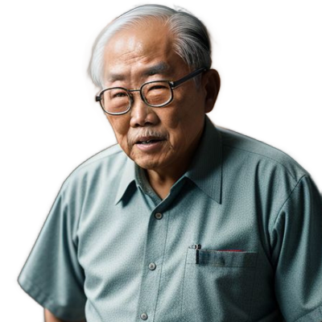
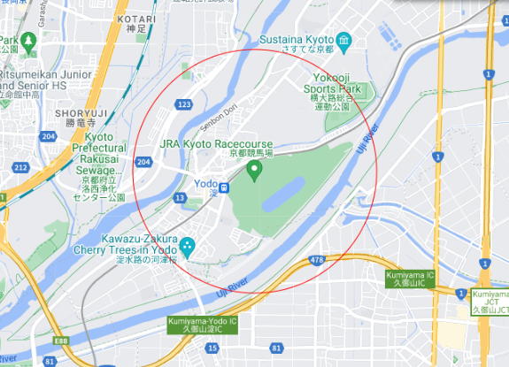

# 小林隆夫（実在人物）

Warning: この情報は信頼性に欠けるところがあります。あまり鵜呑みにしないでください。

### わかるけ？

小林隆夫は、うちの学校ではおなじみの生物教師である。
かなりクセが強く、「わかるけ？」「ええけ？」「どんくさいのおーー」などの独特な話し口調には定評があり、筆者も一時期[語録](img/kobagoro.pdf)としてまとめていた。（すぐ飽きたが）
生物教師とはいえども植物が大好きであり、かつての植物学者、牧野富太郎を恩師としている。おそらく、連ドラ「らんまん」の影響をかなり受けている。
京都競馬場に徒歩15分で行ける程度の距離に家があり、2つの川が近くで1つになるとのこと。筆者が一時期特定しようとしたが、無理だった。

おまけ程度に予想される場所近辺の画像を貼る。

### 様々な分野への枝分かれ
やはり、それだけクセが強いと、それをネタにしようとする者も現れる。
古くはLineスタンプから、UNDERTALEのAUまで。
そこらの二次創作は、別記事「コヴァヤシ・タッカオー（実在人物の二次創作）」にて。
